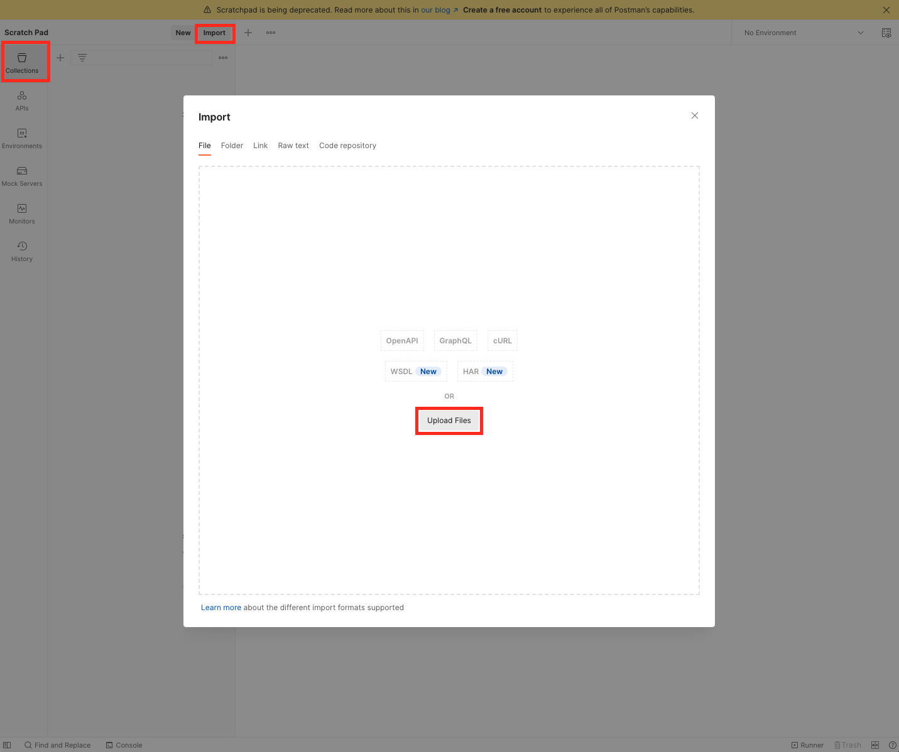
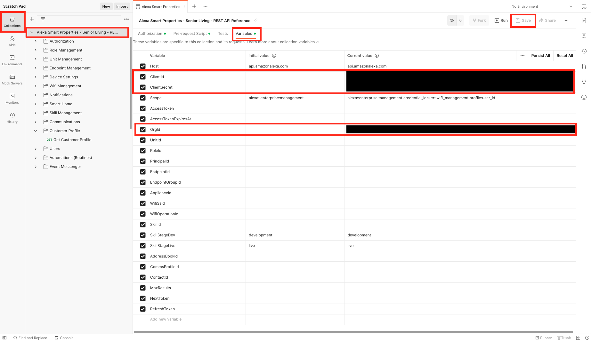
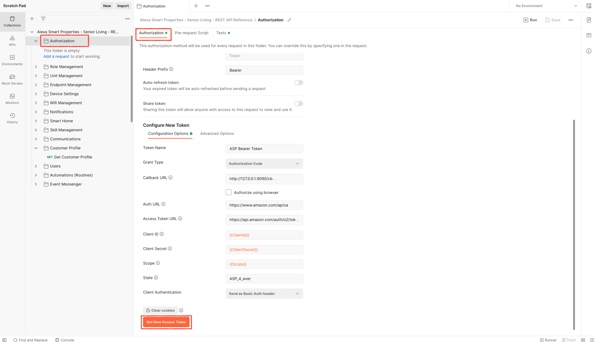
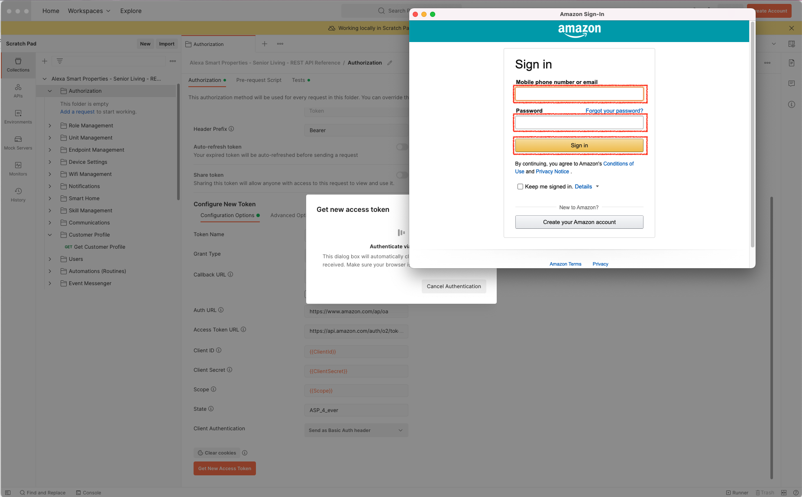
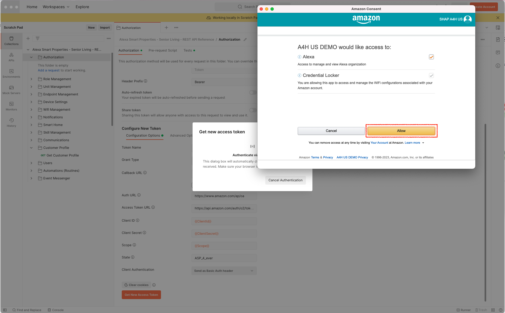
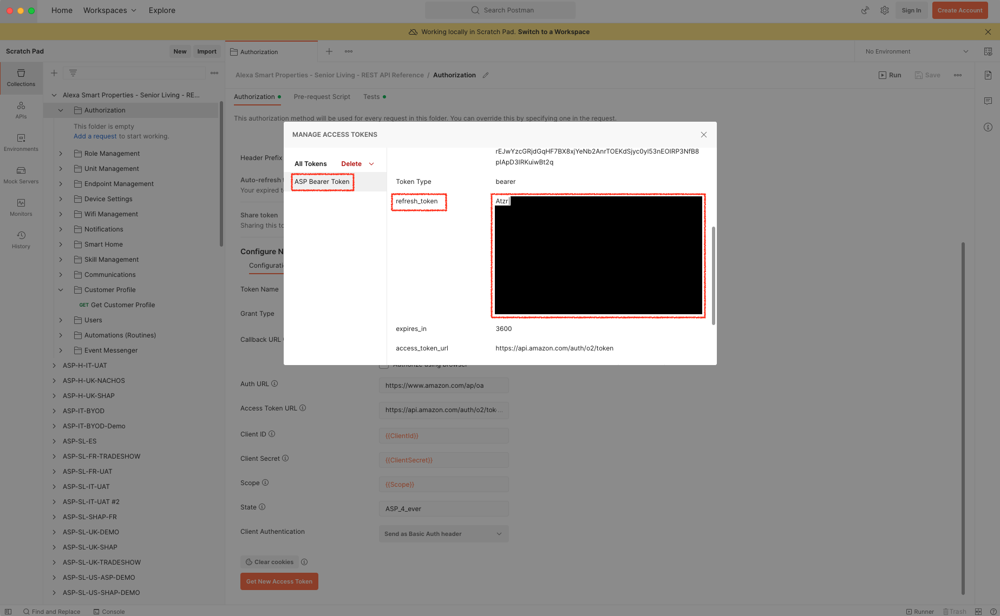
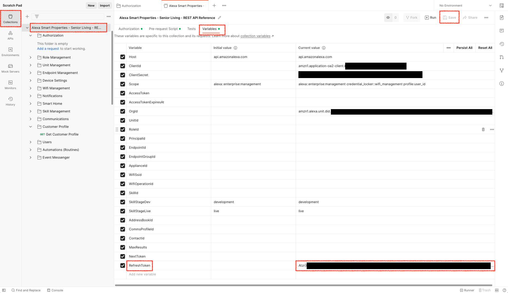
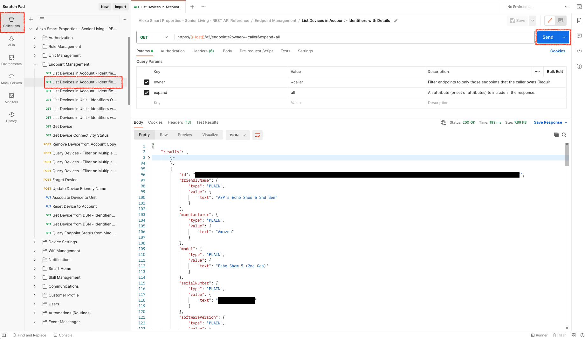
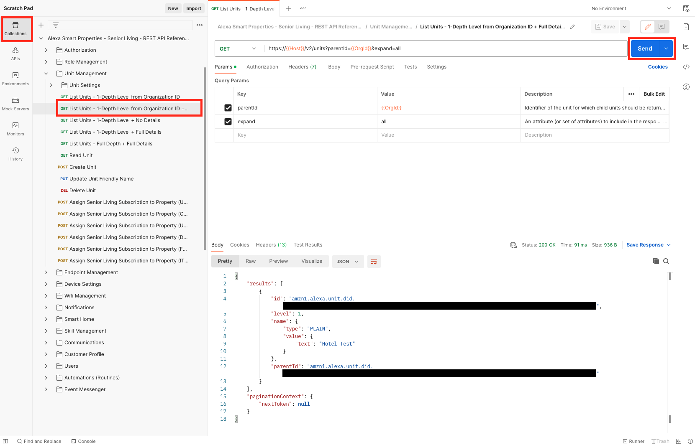
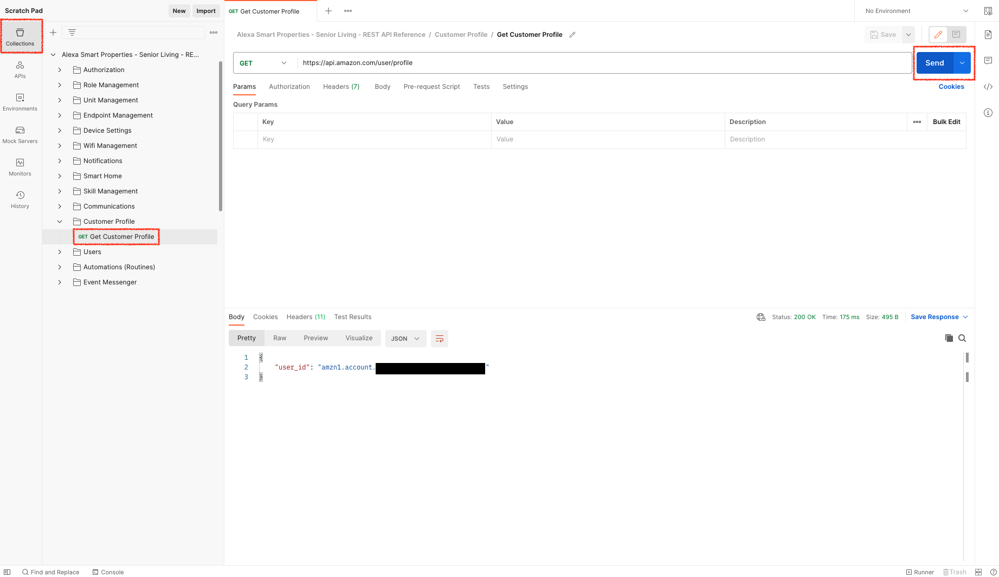

# Postman Collection for Alexa Smart Properties APIs 

This repository offers a single [*Postman Collection*](https://learning.postman.com/docs/collections/collections-overview) across all Alexa Smart Properties Subscriptions and Regions to ease Developers with testing API calls from an already exiting REST Client. It can be used to troubleshoot API calls when coding to ensure format and payload are correct and can also be used as a standalone tool for getting and setting values on properties, units and settings 

---

# Prerequisites
You need to have a valid [Alexa Smart Properties Registration](https://developer.amazon.com/en-US/docs/alexa/alexa-smart-properties/asp-core-get-started.html) with at least one subscription enabled.

---

# Collection Setup

## Step 1: Postman Install

> By the end of this Step, you would have Postman App (desktop or web) correctly configured on your machine.

Follow the instructions from the Postman Getting Started guide available here: https://learning.postman.com/docs/getting-started/installation-and-updates/

---

## Step 2: LWA Security Profile Configuration

> By the end of this Step, you would have defined a LWA Security Profile ready for ASP APIs calling.

1. Create a LWA Security Profile by following the steps in the [LWA console](https://developer.amazon.com/loginwithamazon/console/site/lwa/overview.html), using the *same* Amazon Business account and email address that you registered with Alexa Smart Properties.

> Ensure that you have entered a **Consent Privacy Notice URL** on your LWA Security Profile. This is mandatory to get access to some permissions scopes such as scopes linked to the [Customer Profile Information](https://developer.amazon.com/docs/login-with-amazon/obtain-customer-profile.html).

2. Define **Allowed Return URLS** on the [Web Settings](https://developer.amazon.com/docs/login-with-amazon/register-web.html#add-your-website-to-your-security-profile) of your *LWA Security Profile* to use [Postman to obtain an OAuth 2.0 token](https://learning.postman.com/docs/sending-requests/authorization/oauth-20/#requesting-an-oauth-20-token):

- https://oauth.pstmn.io/v1/browser-callback (for Postman Web App Usage)
- https://oauth.pstmn.io/v1/callback (For Postamn Desktop App Usage)
- https://www.getpostman.com/oauth2/callback (for Postman Legacy Usage)
- https://www.postman.com/oauth2/callback (for Postman Legacy Usage)
- http://127.0.0.1:9090/cb (for Localhost Usage)

3. Grant ASP APIs access to your LWA Client ID from the ASP Console Administration: [US Console](https://www.amazon.com/alexasmartproperties/newconsole/administration/) || [CA Console](https://www.amazon.ca/alexasmartproperties/newconsole/administration/) || [UK Console](https://www.amazon.co.uk/alexasmartproperties/newconsole/administration/) || [FR Console](https://www.amazon.fr/alexasmartproperties/newconsole/administration/) || [DE Console](https://www.amazon.de/alexasmartproperties/newconsole/administration/) || [IT Console](https://www.amazon.it/alexasmartproperties/newconsole/administration/). Once your LWA Client ID would have been registered for API access, you would be able to obtain your ASP Organization identifier (`amzn1.alexa.unit.did.{id}`).

---

## Step 3: Import Collection

> By the end of this Step, you would have imported Postman Collection into your Postman app (desktop or web).

The different options to import data into Postman are documented here: https://learning.postman.com/docs/getting-started/importing-and-exporting-data.

Use the json file included in this repo as the collection you want to import.

Below you can find an illustration to import a Postman Collection from a file available on your filesystem into Postman Desktop App.

---

## Step 4: Update Collection Variables

> By the end of this Step, you would have defined all required Collection Variables to start performing API calls.

To be more flexible and reuse the same values accross multiple requests, [Variables](https://learning.postman.com/docs/sending-requests/variables/) are used accross the Collection. Below you will find the different Variables you need to assign a `Current Value`:

| Variable | Current Value |
| ----------- | ----------- |
| Host | api.amazonalexa.com *or* api.eu.amazonalexa.com |
| ClientId | *The Client ID from the Web Settings of your LWA Security Profile used to grant you API access from the ASP Console* | 
| ClientSecret | *The Client Secret from the Web Settings of your LWA Security Profile used to grant you API access from the ASP Console* |
| Scope | `alexa::enterprise:management` `credential_locker::wifi_management` `profile:user_id` |
| OrgId | *The `amzn1.alexa.unit.did.{id}` you got once you have granted API access to your LWA Client ID from the ASP Console*  |

**!!! Important !!!** each time you update the value of a variable, you must **save** the changes. Otherwise, the new value won't be taken into account.

For your information, the permission provided by each scope is detailed here: 
- `alexa::enterprise:management`: permission to get access to Alexa Management APIs. This basically covers APIs offers into all Alexa Smart Properties Subscriptions.
- `credential_locker::wifi_management`: permission to get access to Amazon Account Wifi Locker. This currently covers the API call to push a new Wifi Configuration on an Amazon Account ([`POST /credentiallocker/v2/saveWifiConfigurations`](https://developer.amazon.com/en-US/docs/alexa/alexa-smart-properties/asp-core-endpoint-api.html#post-savewificonfigurations)).
- `profile:user_id`: permission to get access to Amazon Customer Profile Identifier. This currently covers the API call to get the principalId from an Amazon Account [`GET /user/profile`](https://developer.amazon.com/docs/login-with-amazon/obtain-customer-profile.html#call-profile-endpoint)

> Please note that the usage of Variables is not mandatory into Postman. You may decide afterwards to replace Variables usage from the original Collection by your own mean.

---

## Step 5: Generate a LWA Refresh Token

> By the end of this Step, you would have configured a valid OAuth 2.0 Refresh Token on your Postman Collection to perform requests using the Postman Collection.

To call the APIs, you must include your API access token as part of the `Authorization` request header of each API call. 

Access tokens will expire after a set time period (for a LWA access token, this is usually set to 60 minutes expiration). When you obtain an access token, you will also receive a refresh token. You can use a refresh token to retrieve a new access token. 

Each Collection provided into this repository is embedding a "Pre-request Script" to manage for you the retrieval of a new access token from a refresh token.

All you have to do here is to obtain a Refresh Token directly from the Collection following the below instructions:

**5.1.** Locate the `Authorization` folder in the collection. We will use the "Authorization" tab from Postman to initiate the generation of an (Access, Refresh) token pair by hitting "Get New Access Token" button as shown below. 

**5.2** Once the Authorization process has been initiated from previous step, you would be requested to input your Amazon Account Credentials. Here, you will connect with the Amazon Account that is considered as the ASP Operator for programmatic access.

**5.3** Into this step, you will confirm that you grant permission to use Alexa Management APIs, Credentials Locker APIs and Customer Profile User ID from the (Access, Refresh) token pair that will be generated.

> Note: For the  to Customer Profile User ID (the `user_id` also known as `principalId`), because no personal information is requested, the user will not be presented with a consent screen the first time they log in.

**5.4** Once you would have consent to the permission, the Authorization Callback will bring you back to Postman where you will copy the Refresh Token (`refresh_token`) to register it into the Collection Variables

> Note: To avoid mixing `access_token` and `refresh_token`, ensure that you copy the token starting with `Atzr|...`

**5.5** To finalize the operation, you will paste the `refresh_token` value into the Collection Variable named `RefreshToken`

> Note: Don't forget to save your variables collection after you have copy-paste the refresh token.

---

## Step 6: Perform API Calls

> By the end of this Step, you would have validated that you can successfully perform API calls using this Postman Collection.

<-- #TODO finish how to test-->

To ensure your Postman Collection is correctly configured, you can try the three below API calls and observe the typical expected output.

### **Test #1: List devices from your Amazon Account**

### **Test #2: List properties from your ASP Organization**

## **Test #3: Obtain your Amazon Account User ID**

---

### **Important**: `Host` for API Calls can differ from one country to another, please respect the below mapping:

| Service | North America Region | Europe Region |
| ----------- | ----------- | ----------- |
| Countries | US, CA | UK, FR, DE, IT |
| LWA| api.amazon.com | api.amazon.com |
| Alexa| api.amazonalexa.com | api.eu.amazonalexa.com |
| Credentials Locker| credential-locker-service.amazon.com | credential-locker-service.amazon.eu |

---

# Resources

**Login With Amazon**

- [Manage Authorization Code Grant from Login With Amazon](https://developer.amazon.com/fr/docs/login-with-amazon/authorization-code-grant.html)
- [Obtain Customer Profile Information from Login With Amazon](https://developer.amazon.com/docs/login-with-amazon/obtain-customer-profile.html)

**Alexa Smart Properties**
- [Hospitality REST API Reference](https://developer.amazon.com/en-US/docs/alexa/alexa-smart-properties/alexa-for-hospitality-rest-api.html)
- [Senior Living REST API Reference](https://developer.amazon.com/en-US/docs/alexa/alexa-smart-properties/asp-in-senior-living-rest-api.html)
- [Healtcare REST API Reference](https://developer.amazon.com/en-US/docs/alexa/alexa-smart-properties/asp-in-healthcare-rest-api.html)
- [PBX REST API Reference](https://developer.amazon.com/en-US/docs/alexa/alexa-smart-properties/pbx-api-for-alexa-smart-properties.html)

**Postman**
- [Postman Install](https://learning.postman.com/docs/getting-started/installation-and-updates/)
- [Postman Collection](https://learning.postman.com/docs/sending-requests/intro-to-collections/)
- [Postman Variables](https://learning.postman.com/docs/sending-requests/variables/)

---

# License

This library is licensed under the Amazon Software License
